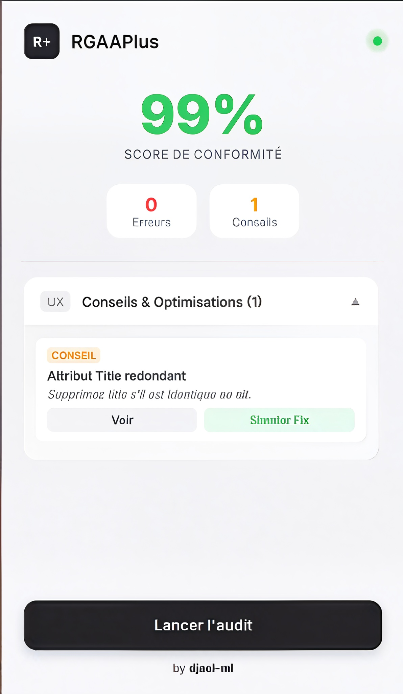
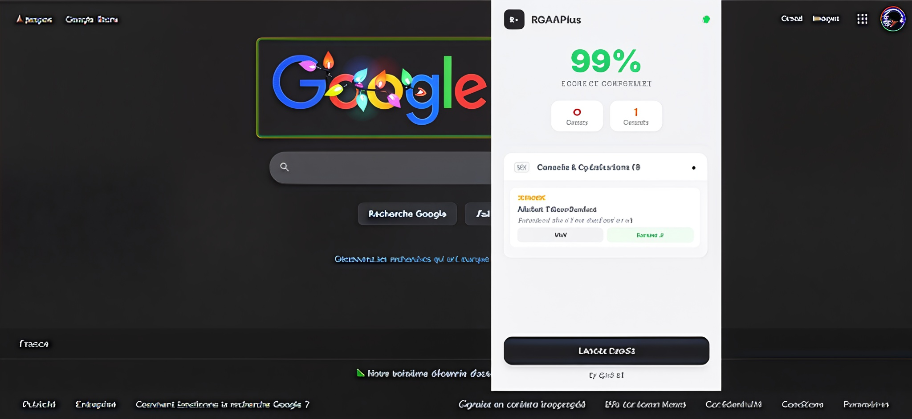

<div align="center">
  
  <h1>RGAAPlus</h1>
  <p>
    <strong>L'audit d'accessibilité web nouvelle génération.</strong>
  </p>
  <p>
    <a href="#installation">Installation</a> •
    <a href="#fonctionnalités">Fonctionnalités</a> •
    <a href="#aperçu">Aperçu</a>
  </p>
  
  
  
  
</div>

<br>

**RGAAPlus** est une extension de navigateur conçue pour les développeurs et designers exigeants. Elle permet de vérifier la conformité d'une page web avec le référentiel **RGAA** (Référentiel Général d'Amélioration de l'Accessibilité) via une interface moderne, épurée et non intrusive.

Contrairement aux outils classiques, RGAAPlus ne se contente pas de lister des erreurs : il propose des correctifs et permet de **simuler les corrections en temps réel** sur la page.

---

## ✨ Fonctionnalités

* **Audit Instantané :** Analyse complète du DOM basée sur les critères RGAA (Images, Liens, Structure, etc.).
* **Design Premium :** Une interface utilisateur soignée ("Apple-style"), claire et lisible.
* **Highlight In-Context :** Les éléments en erreur sont surlignés directement dans la page avec des infobulles explicatives.
* **Simulation de Fix 🛠️ :** Une fonctionnalité unique qui permet de visualiser le résultat d'une correction (ex: ajout d'un attribut ALT ou sécurisation d'un lien) sans toucher au code.
* **Conseils UX & Sécurité :** Détection des bonnes pratiques (ex: sécurité des liens `target="_blank"`, redondance des attributs `title`).
* **Privacy First :** Fonctionne 100% en local. Aucune donnée n'est envoyée à l'extérieur.

---

## 📸 Aperçu

| Tableau de Bord | Visualisation sur page |
| :---: | :---: |
|  |  |

---

## 🚀 Installation (Mode Développeur)

L'extension n'étant pas encore sur le Chrome Web Store, vous pouvez l'installer manuellement très facilement :

1.  **Clonez ce dépôt** ou téléchargez le ZIP :
    ```bash
    git clone [https://github.com/djael-ml/RGAAPlus.git](https://github.com/djael-ml/RGAAPlus.git)
    ```
2.  Ouvrez votre navigateur (Chrome, Edge, Brave...) et allez à l'adresse :
    `chrome://extensions/`
3.  Activez le **Mode développeur** (bouton en haut à droite).
4.  Cliquez sur le bouton **Charger l'extension non empaquetée** (Load unpacked).
5.  Sélectionnez le dossier `RGAAPlus` que vous venez de télécharger.

L'icône **R+** apparaîtra dans votre barre d'outils.

---

## 🛠 Stack Technique

* **Manifest V3** : Dernière norme de sécurité Google Chrome.
* **Vanilla JS** : Aucun framework lourd, performance maximale.
* **CSS3** : Variables CSS, Glassmorphism, Animations fluides.
* **Architecture** : Modulaire (Séparation stricte Logique / Règles / UI).

---

## 🤝 Contribuer

Les contributions sont les bienvenues ! Si vous souhaitez ajouter de nouvelles règles RGAA ou améliorer l'interface :

1.  Forkez le projet.
2.  Créez votre branche (`git checkout -b feature/AmazingFeature`).
3.  Committez vos changements (`git commit -m 'Add some AmazingFeature'`).
4.  Push on the branch (`git push origin feature/AmazingFeature`).
5.  Ouvrez une Pull Request.

---

## 📄 Licence

Distribué sous la licence MIT. Voir `LICENSE` pour plus d'informations.

---

<div align="center">
  Développé avec ❤️ par <a href="https://github.com/djael-ml">djael-ml</a>
</div>
